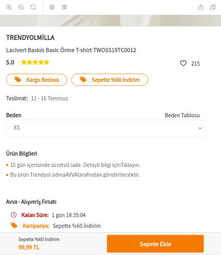
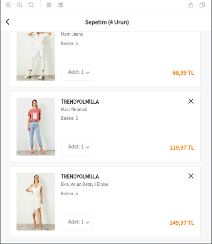
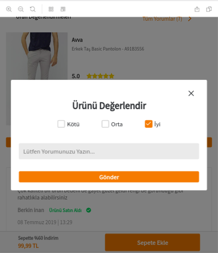

[](https://scorecard.dev/viewer/?uri=github.com/Trendyol/quarkify)


<!-- PROJECT LOGO -->
<br />
<p align="center">
  <a href="https://github.com/Trendyol/quarkify">
    
  </a>

  <h3 align="center">Quarkify</h3>

  <p align="center">
    An awesome lightweight React UI Component library
    <br />
    <a href="https://quarkify-d871b.firebaseapp.com/"><strong>Explore the docs »</strong></a>
    <br />
    <br />
    <a href="https://trendyol.github.io/quarkify">View Demo</a>
    ·
    <a href="https://github.com/Trendyol/quarkify/issues">Report Bug</a>
    ·
    <a href="https://github.com/Trendyol/quarkify/issues">Request Feature</a>
  </p>
</p>

[![Build Status][build-shield]][build-url]
[![codecov][codecov-shield]][codecov-url]
[![contributions welcome][contributors-shield]][contributors-url]
[![MIT License][license-shield]][license-url]


<!-- TABLE OF CONTENTS -->
## Table of Contents

* [About the Project](#about-the-project)
  * [Built With](#built-with)
* [Getting Started](#getting-started)
  * [Installation](#installation)
* [Usage](#usage)
  * [Examples](#examples)
* [Contributing](#contributing)
* [License](#license)   
* [Acknowledgements](#acknowledgements)


<!-- ABOUT THE PROJECT -->
## About The Project

<p>
    
    
    
</p>

There are many great UI libraries for react available but almost all of them are
highly customizable and full of boilerplate code, so we decided to create our own
lightweight React Component library and you should give it a try.

Here's why:
* Your time will be spent doing actual work instead of creating simple components.
* You will not worry about consistency across your components.
* Each component is implemented with accessibility in mind. :smile:

You may also suggest changes by forking this repo and creating a pull request or opening an issue with the tag.


### Built With

* [React](https://reactjs.org/)
* [Create-React-App](https://github.com/facebook/create-react-app)
* [SASS](https://sass-lang.com/)
* [Jest](https://jestjs.io/)
* [Enzyme](https://airbnb.io/enzyme/)
* [Classnames](https://github.com/JedWatson/classnames)
* [Typescript](https://www.typescriptlang.org/)


<!-- GETTING STARTED -->
## Getting Started

To get a local copy up and running follow these simple example steps.


### Installation
* To add quarkify library to your project
1. Simply run one of the commands below in your project directory.

```sh
npm install quarkify@latest --save
```
or
```sh
yarn add quarkify 
```


* To install storybook locally
1. Clone the repo
```sh
git clone https://github.com/Trendyol/quarkify.git
```
2. Install NPM packages
```sh
npm install
```
   Or alternatively Yarn
```sh
yarn install
```
3. Run tests
```sh
npm run test
yarn run test
```
4. Run storybook
```sh
npm start
yarn start
```

<!-- USAGE EXAMPLES -->
## Usage

To preview the live demo and see usages of the components please
refer to our [demo][storybook-url]

### Examples

We have several examples on our [document][docsify-url]. Here is the first one to get you started:

```js
import Button from "quarkify/components/button"

function App() {
  return (
    <div className="App">
      <Button variant={"primary"} >Hello World</Button>
    </div>
  );
}
```

This will render Button component with primary variant:

[![Button Component][button]](#)

As you can see, to import components into your project, you need to specify the path as 
```
"quarkify/components/{component-name}"
```

Furthermore, to use `Modal` component:
```js
import Button from "quarkify/components/button"
import Modal from "quarkify/components/modal";

let show = false;

function handleChange() {
  show = !show
}

function closeModal() {
  show = false
}

function App() {
  return (
    <div className="App">
      <Button onClick={handleChange}>Toggle Me</Button>
      <Modal show={show} animation={"slideInUp"}>
        <Modal.Header
          onClose={closeModal}
          leftIcon={"back-button"}
          leftIconOnClick={closeModal}
        >
          Some Title
        </Modal.Header>
        <Modal.Content>
          <p>Some content</p>
        </Modal.Content>
        <Modal.Actions>
          <Button onClick={closeModal} fluid>
            Ok
          </Button>
        </Modal.Actions>
      </Modal>
    </div>
  );
}
```

When button is toggled, it will render the modal as it is seen below:

[![Modal Component][modal]](#)

For more examples, please refer to the [documentation][docsify-url]


<!-- CONTRIBUTING -->
## Contributing

Any contributions you make are **greatly appreciated**.

1. Fork the Project
2. Create your Feature Branch (`git checkout -b feature/AmazingFeature`)
3. Commit your Changes (`git commit -m 'Add some AmazingFeature'`)
4. Push to the Branch (`git push origin feature/AmazingFeature`)
5. Open a Pull Request

Please don't forget to check our commit message styles as we want to have
consistency across our commit logs.


<!-- LICENSE -->
## License

Distributed under the MIT License. See `LICENSE` for more information.


<!-- ACKNOWLEDGEMENTS -->
## Acknowledgements
* [Img Shields](https://shields.io)
* [Choose an Open Source License](https://choosealicense.com)
* [Readme Template](https://github.com/othneildrew/Best-README-Template)


<!-- MARKDOWN LINKS & IMAGES -->
<!-- https://www.markdownguide.org/basic-syntax/#reference-style-links -->
[build-shield]: https://img.shields.io/badge/build-passing-brightgreen.svg?style=flat-square
[build-url]: https://github.com/Trendyol/quarkify/pulse
[codecov-shield]: https://codecov.io/gh/Trendyol/quarkify/branch/master/graph/badge.svg
[codecov-url]: https://codecov.io/gh/Trendyol/quarkify
[contributors-shield]: https://img.shields.io/badge/contributions-welcome-brightgreen.svg?style=flat
[contributors-url]: https://github.com/Trendyol/quarkify/issues
[license-shield]: https://img.shields.io/badge/license-MIT-blue.svg?style=flat-square
[license-url]: LICENSE
[storybook-url]: https://trendyol.github.io/quarkify
[docsify-url]: https://quarkify-d871b.firebaseapp.com/
[button]: images/button.png
[modal]: images/modal.png
